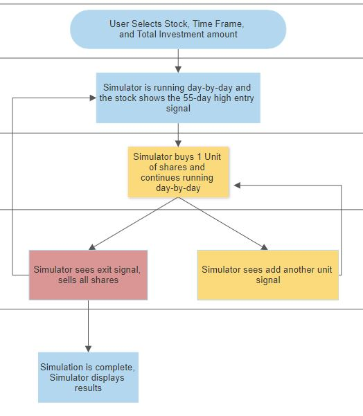
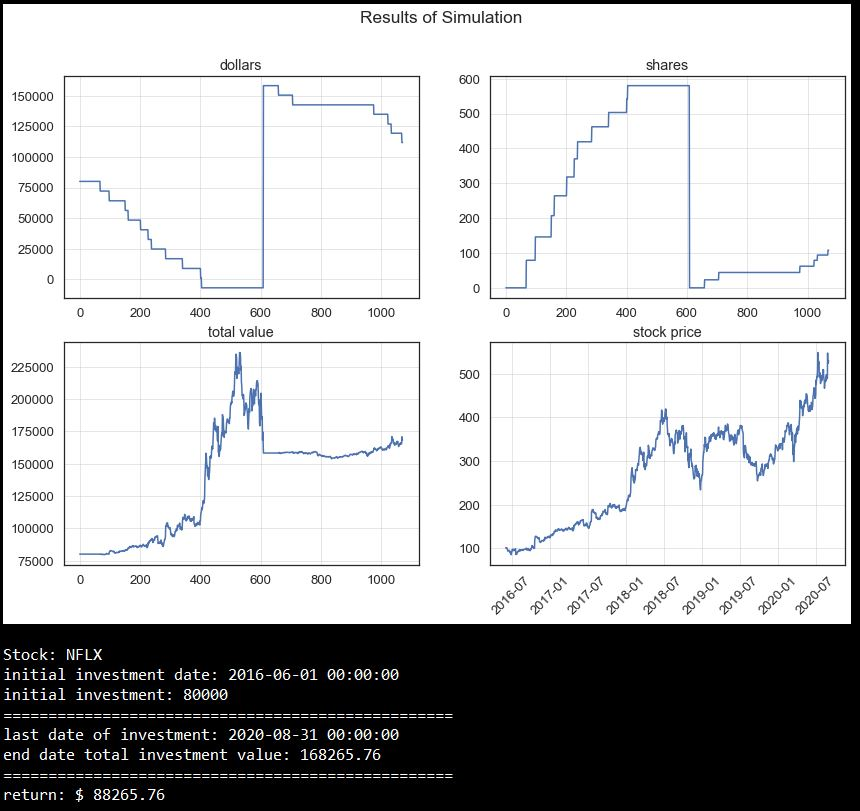

# Turtle Trading Simulator
Project Objective: Create a python simulator that implements the famous "Turtle Trading" strategy on any stock for any time frame and displays the results
- author: Michael O'Donnell
- created: 5/15/20

## To test this project:
Simply open the python file "turtle_trading_simulator.py" and change the parameters listed at the top:
- stock
- start_date
- end_date
- investment_dollars

## About the Turtle Trading Rules implemented:
- each trading unit is 1% of your total investment dollars
- enter at a stock's 55-day high with 1 unit
- add another unit if the stock climbs to .5N (N is the Average True Range)
- exit if the stock dips below latest entry price minus N

## About the data
All data in this project is from Yahoo Finance. The Yahoo Finance data is imported into pandas dataframes via the python library “yfinance”.

## Data Science Tools Used:
- ModSim
- pandas
- yfinance
- matplotlib

## Example of results:

## Room for improvement
Turn this into a dash application! Also, implement more Turtle Trading rules for shorting stocks
